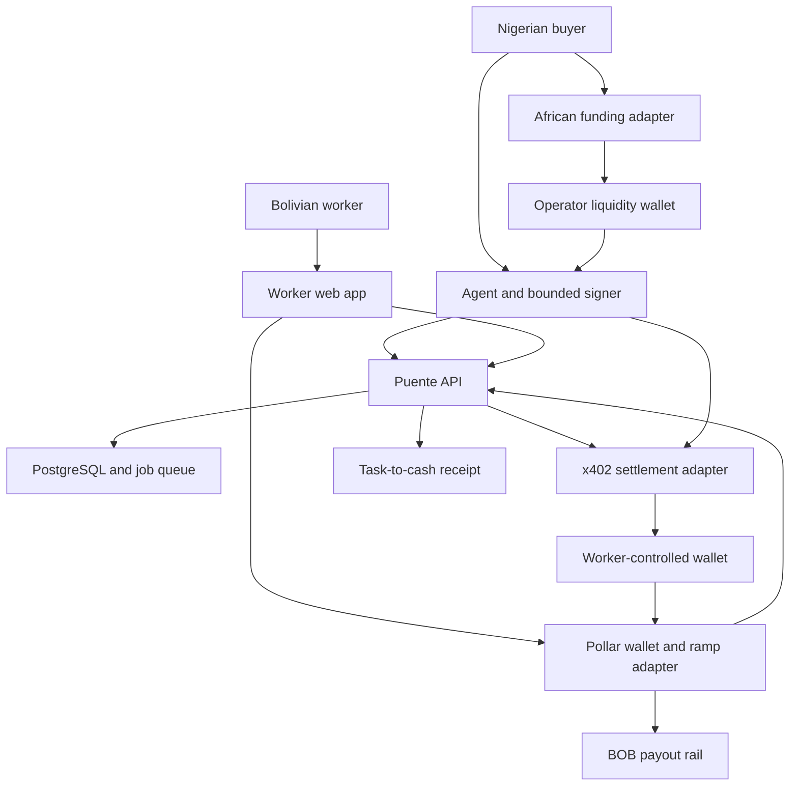
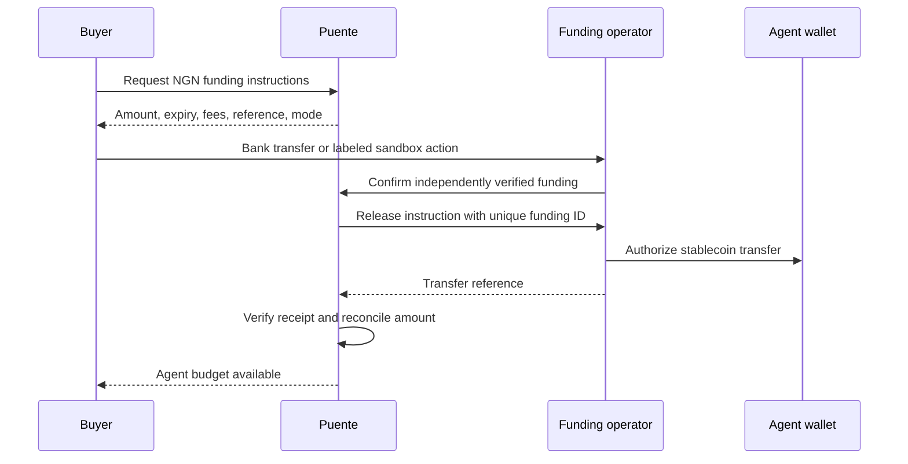
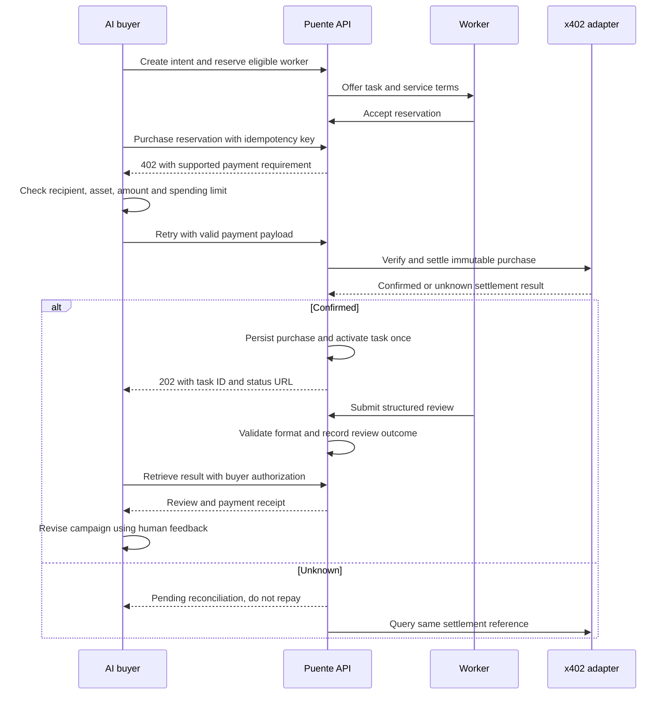
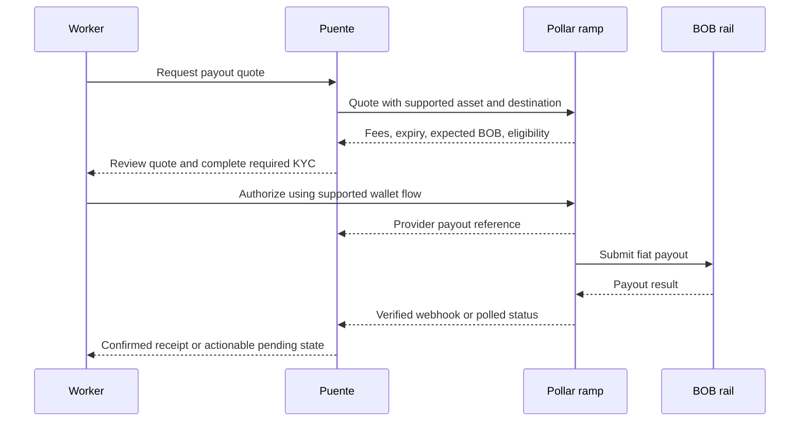
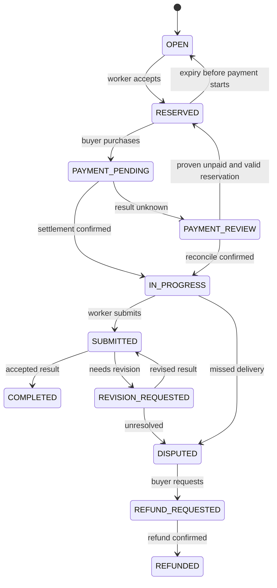

# Puente — architecture and implementation contract

De real iManuel • 16 September 2026 • Build handoff.

## 1. Product and competition objective

**Your AI can search the internet. Puente lets it ask someone on the ground—and pay them.**

Puente is an x402-powered marketplace for local human intelligence. An African-funded AI buyer commissions a Bolivian worker to review culturally sensitive campaign language, receives a structured result, changes its campaign using that result, and connects the worker to local BOB cash-out through Pollar.

Preserve the complete foundation: AI buyer, human marketplace, x402 purchase, non-custodial worker wallet, African funding, Pollar integration, local cash-out, and task-to-cash receipt. Time pressure determines implementation order, not a replacement product. The human-tool API and traceable corridor are additions to the original idea.

First-place positioning is a goal, not a predicted award. No verified scoring rubric or competitor audit is available. Do not claim unique market ownership, guaranteed victory, measured savings, or completed live transfers before evidence exists.

## 2. Source-grounded constraints

The supplied organizer brief says the flagship challenge connects an African funding/cash-out leg to Pollar's live Bolivian BOB ramp; sandbox or documented semi-manual African flow is acceptable. It lists submission at **18 September 2026, 13:00 UTC / 14:00 Nigeria time**. Treat this as the working deadline and confirm it: the page's “five days” prose conflicts with its listed dates.

The live Boundless page could not be retrieved in this research session. Pollar SDK package, version, access, wallet signing, x402 network support and BOB ramp contracts remain unverified. A Telegram reply saying “Yes” does not specify an integration contract. Official general x402 documentation was accessible; it establishes HTTP payment negotiation, not compatibility of a particular Stellar facilitator. See SOURCES.md.

## 3. Demonstration story and outcome

A Nigerian small business wants to localize three campaign headlines for Bolivia. Its agent requests a Bolivian Spanish review. A worker accepts, receives the task purchase payment, supplies a preferred headline, rewritten copy, rationale and warnings. The agent consumes the result and revises the campaign. The worker authorizes BOB cash-out.

Use a real willing reviewer if available; otherwise label a team member as the demo worker. Never imply a seeded character is an independent customer. The first template is text-based, avoiding attachment upload dependencies while still performing real human judgment. Geographic presence is self-declared unless separately verified; KYC does not establish location or expertise.

## 4. Architecture decisions

| Decision | Build choice | Reason / consequence |
|---|---|---|
| Application | TypeScript modular monolith; React web client, Node API, small agent CLI | Shared types and one language; separate deployable processes only when useful |
| Persistence | PostgreSQL, migrations, transactions; database-backed jobs | Survives laptop shutdown and API restart; avoids a Redis dependency |
| Agent | Real model adapter plus deterministic replay fixture | Show actual model use when configured; label replay clearly |
| Settlement | Worker reservation before x402 purchase; direct payment to assigned worker | Keeps Puente outside worker key custody; accepts explicit prepayment risk |
| Long-running work | Purchase returns task reference; authenticated polling retrieves result | HTTP request need not stay open while human works |
| Signing | Buyer-controlled bounded agent signer; worker-controlled Pollar-supported signer | Puente server never silently sweeps worker funds |
| Funding | Documented Nigerian operator/provider adapter with explicit liquidity release | NGN confirmation is distinct from stablecoin delivery |
| Cash-out | Worker consent for quoted BOB payout | Automatic mode only with verified supported scoped authorization |
| Deployment | Hosted API/database and web client where available | Operator laptop is a client, not the runtime that must remain powered |

Use a runtime supported by the pinned SDK. No invented package versions. No new chain bridge to compensate for an unverified Stellar x402 integration. A testnet payment cannot fund a mainnet cash-out: keep those evidence tracks separate.

### System diagram



Arrows express logical dependencies and money-flow intent, not a verified Pollar network contract. UI signing and provider calls must follow the confirmed SDK.

## 5. Money and control model

There are three independently reconciled legs:

1. Buyer sends NGN to the explicitly identified demo operator or approved provider. A sandbox confirmation is marked sandbox; a screenshot alone does not prove payment.
2. After independent confirmation, the operator releases its pre-funded supported stablecoin to the buyer's agent wallet. Record funding order, rate, fees, amount and transfer reference. In sandbox, use test assets and label the release accordingly.
3. Agent pays the reserved worker through x402. Worker cashes out through Pollar using the same real asset/network only if supported.

For the hackathon, platform service fee may be zero. This avoids an unverified split-payment requirement. Record ramp and network fees separately. Money uses integer base units and explicit currency/asset identifiers, never JavaScript floating-point arithmetic. Do not assume USDC asset code alone uniquely identifies an asset; record network, issuer/contract and decimals verified from the integration.

**Custody boundaries:** the operator controls its liquidity and receives fiat in the semi-manual flow. The buyer controls its agent signer. The worker controls their wallet. Puente stores references, not worker private keys. This is not an assertion that every participant in the corridor is non-custodial or that the product has regulatory approval.

**Prepayment risk:** direct settlement pays before work is delivered. Puente cannot claw back funds, escrow them, or enforce a refund from the worker wallet. Show terms before purchase: delivery deadline, revision window, and requested-refund process. A worker-signed refund is separately tracked to confirmation. A future escrow adapter remains in the architecture but is not misrepresented as active. Paying a second worker after non-delivery needs fresh buyer authorization.

Payout eligibility after delivery is a Puente UI policy, not an on-chain lock: a worker with custody can transfer their funds independently. Document this honestly.

### Funding sequence



### Task purchase sequence



### Cash-out sequence



## 6. State machines and invariants

Keep task, payment, funding and payout state separate. A completed task does not mean fiat arrived.



Payout: QUOTED → AUTHORIZATION_REQUIRED → SUBMITTED → PROCESSING → PAID / FAILED; UNKNOWN → reconciliation. Funding: INSTRUCTIONS_ISSUED → FIAT_CONFIRMED → RELEASE_PENDING → ASSET_CONFIRMED; include EXPIRED, FAILED and REVIEW_REQUIRED. Payment: CREATED → VERIFYING → SETTLING → CONFIRMED / FAILED / UNKNOWN.

Invariants:

- One settled payment per purchase; one purchase per reserved task. Unique settlement reference and buyer/idempotency key.
- Same key with different canonical request hash returns 409. Same successful key returns original response.
- Bind amount, recipient, network, asset, task hash, buyer and quote expiry to the immutable purchase record. Use supported signed extensions if available; do not claim application hashing makes protocol data cryptographically bound.
- Stop reservation reassignment once settlement starts. A late confirmation activates the original assignment or enters review; never quietly credits another worker.
- Verified means acceptable authorization; settled means payment confirmed. Never equate them.
- An unknown external result is reconciled before retrying a money movement.
- Duplicate provider events change state at most once. Out-of-order events cannot downgrade PAID.
- Cash-out on an expired quote requires a new quote and consent. Never silently change recipient or amount.
- Result reads are private to buyer, assigned worker and authorized reviewer. Payment alone is not authorization to read someone else's task.

External settlement and the database cannot share one transaction. Persist purchase intent before settlement; record the external reference promptly; use a durable reconciliation job after crashes. The SDK middleware's settle timing must be inspected: do not release payable work solely because a route handler ran.

## 7. Data model

| Table | Required fields and constraints |
|---|---|
| users | id, role, display name, authenticated subject; no raw identity documents |
| worker_profiles | user_id, country self-declaration, languages, available, provider wallet reference |
| agent_accounts | buyer_id, public address, policy reference, daily spend cap; no browser secrets |
| funding_orders | buyer_id, NGN minor units, expected asset units, rate, fees, mode, external refs, status |
| task_intents | buyer_id, schema version, content, locale, requirements, request hash, deadline |
| reservations | task_id unique active assignment, worker_id, expiry, frozen purchase terms |
| purchases | reservation_id unique, buyer_id, idempotency_key, request_hash, amount units, asset, status |
| settlements | purchase_id, network, tx/provider reference unique, recipient, observed amount, confirmation time |
| submissions | task_id, worker_id, version, structured result, submitted_at; immutable versions |
| reviews | submission_id, reviewer, decision, reasons; schema check separate from subjective acceptance |
| payout_orders | worker_id, quote_id, quote expiry, units, BOB estimate, fees, provider ref unique, status |
| webhook_events | provider + event_id unique, payload digest, verified_at, processed_at |
| audit_events | aggregate ID, event, actor, timestamp, source mode, redacted metadata |
| jobs | kind, aggregate_id, attempts, run_after, lease_until; dedupe unique active job |

Index buyer/task list queries and job status/run_after. Transactions protect reservation acquisition and spending-budget reservation. Debit/reserve the agent budget atomically before external settlement; release only after confirmed nonpayment. Wallet balance remains independently verified and is not replaced by this internal accounting record.

For this direct-pay design, receipts are a transfer journal, not a custodial account balance or full bank ledger. Reconcile ordered amount, received asset, x402 payment and payout separately. Do not sum NGN, USDC and BOB without explicit conversion.

## 8. Proposed application API

These routes are Puente design contracts, not Pollar SDK methods.

| Route | Access | Behavior |
|---|---|---|
| POST /api/funding-orders | buyer | Create instructions; never mark paid from client |
| POST /api/operator/funding/:id/confirm | operator | Confirm verified bank/provider event with audit |
| POST /api/task-intents | buyer agent | Validate template and budget; create intent |
| GET /api/worker/tasks | worker | Eligible open offers only |
| POST /api/reservations | worker | Atomic acceptance, returning expiry |
| POST /api/reservations/:id/purchase | owning buyer | x402 protected; 402 unpaid, 202 settled, 409 conflicts |
| GET /api/tasks/:id | authorized participant | State and allowed next action |
| POST /api/tasks/:id/submissions | assigned worker | Versioned structured result |
| POST /api/tasks/:id/reviews | owning buyer/reviewer | Accept or revision with reasons |
| GET /api/tasks/:id/result | owning buyer | 202 pending, 200 available; no repeat payment |
| POST /api/payout-quotes | worker | Fetch quote and KYC eligibility |
| POST /api/payouts | worker | Supported authorization reference and idempotency key |
| POST /api/webhooks/:provider | provider-authenticated | Verify raw signature and persist event |
| GET /api/receipts/:taskId | authorized participant | Redacted linked evidence |
| GET /health | public minimal | Liveness only; no secrets or balances |

Task request example:

```json
{"template":"bolivia_campaign_review_v1","country":"BO","language":"es-BO","headlines":["Headline A","Headline B","Headline C"],"requirements":["Choose the most natural headline","Rewrite awkward wording","Explain cultural risks"],"budget":{"asset":"CONFIGURED_ASSET_ID","maxBaseUnits":"CONFIGURED_LIMIT"},"deliveryWindowMinutes":20}
```

Result contract:

```json
{"preferredHeadlineIndex":1,"revisedHeadline":"Worker-provided text","rationale":"Worker explanation","culturalWarnings":[],"reviewerDeclaration":{"language":"es-BO","locationVerified":false},"submissionVersion":1}
```

Schema validation checks completeness, types and length. It does not certify cultural truth. The model may summarize and flag issues, but cannot silently deny a worker payment based on ungrounded subjective scoring.

## 9. Adapter boundaries

Define internal ports and implement fixture/live variants: FundingPort (instructions, confirm, releaseStatus); X402Port (requirements, verify, settle, lookup); WalletPort (connect, publicAddress, requestAuthorization); RampPort (eligibility, quote, submit, status); ModelPort (plan, consumeReview).

Each returns sourceMode = LIVE | TESTNET | SANDBOX | MANUAL | FIXTURE plus providerReference and observedAt. MANUAL is not synonymous with fake: record whether actual money moved. A fixture adapter never creates a live-looking transaction URL. Missing live credentials fail closed with an actionable configuration error, never a silent fixture fallback.

## 10. User experience

Four workspaces, one shared timeline:

- Buyer: campaign brief, original AI suggestion, budget funding, task progress, revised campaign with human rationale.
- Worker: language/country onboarding, available offers, accept task, structured response, wallet earnings and cash-out quote.
- Operator: funding confirmation evidence, liquidity release reference, reconciliation queue, provider health. Privileged and inaccessible to buyers.
- Receipt: task reference, funding mode, settlement evidence, result timestamp, payout status and redacted BOB reference.

Suggested visual direction: warm off-white background, deep navy text, emerald payment states, amber pending states; English/Spanish key labels. This is a new Puente design proposal, not an inherited brand requirement. Accessible contrast, mobile-first layouts and persistent progress matter more than decorative maps. Put integration modes in a judge evidence drawer; show actionable status to ordinary users.

## 11. Security and failure behavior

Authenticate every role. Protect mutations against CSRF when cookie-based; constrain CORS. Operator endpoints require server-enforced privileges. Rate-limit free intent creation. Treat worker text as untrusted input: delimit it for the model, do not execute embedded instructions, and prevent it from raising spend limits or changing payout destination. Signing policy enforces allowlisted network/asset, approved origin, maximum amount and task budget outside the model.

Keep worker signing client-side/provider-controlled as documented. Store provider secrets and agent demo signer only in server/agent secret configuration; never logs or source control. Use a dedicated small funded demo wallet. Webhooks require documented signature/timestamp checks or confirmed provider lookup, not a guessed signature algorithm. Poll when webhooks are unavailable. Mask account details in receipts and recordings. Keep KYC in the provider's supported flow; store provider status/reference only.

Failure cases: no worker → waiting and no charge; quote expires → requote; invalid payment → reject and no task activation; settlement timeout → pending reconciliation; task not delivered → dispute and refund request; insufficient liquidity → funding review, no fictional credit; cash-out below minimum → show threshold; KYC pending → explain next action; payout timeout → query same reference; system restart → durable jobs resume.

## 12. Validation and definition of done

Meaningful automated checks: concurrent worker reservation has one winner; repeated purchase settles once; same key/different body fails; crash after external success reconciles without charging again; unpaid result access denied; cross-buyer access denied; duplicate/out-of-order webhook safe; expired payout quote rejected; restart resumes pending work; malicious worker instructions cannot alter signer policy.

Integration proof: pinned SDK installs; real supported wallet flow; x402 requirement/retry/settlement evidence; one structured human submission consumed by agent; Pollar quote and status responses; African operator mapping with real or labeled sandbox records. Testnet and mainnet must not be merged into one purported transfer.

Submission complete means repository can be reproduced from a clean checkout, .env.example has no secrets, commands work, modes and limitations are documented, demo link works, and all README evidence matches observed behavior. Document measured task latency, fees and payout timing only after recording them.

## 13. Expansion contracts retained

Automatic threshold cash-out: store desired threshold and destination; notify/quote at threshold; execute only with supported scoped consent. Yield: separate opt-in adapter after spendable liquidity needs and withdrawal timing are understood; never route task budgets or worker assets silently. Escrow: future settlement adapter with explicit release/refund authority. More countries/templates: provider and task-template registry. MCP wrapper: expose the same human-tool contract after the HTTP flow is proven. These are retained product paths; their UI must not imply they already work.
