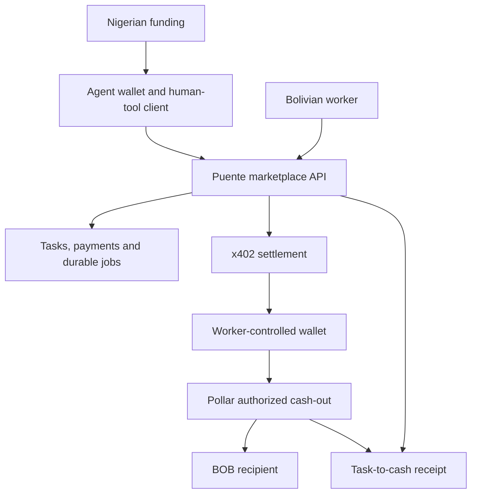

# Puente

### Your AI can search the internet. Puente lets it ask someone on the ground—and pay them.

**An x402-powered marketplace for local human intelligence, connecting African-funded AI buyers to Bolivian workers through Pollar.**

Pollar Hackathon • Flagship Africa–Latin America corridor • Builder: De real iManuel

> Build status: architecture and implementation handoff. This README describes the intended submission. Update the evidence table with verified implementation results before submitting; no live integration or payout is claimed yet.

## Why we are building this

An AI can draft a campaign in Spanish. It still needs a way to commission a person who understands a particular local context, receive their judgment in a usable format, and compensate them across borders.

Puente turns that need into a human tool call. A Nigerian business's AI agent asks a Bolivian reviewer to improve a campaign, purchases the task through x402, receives structured feedback, and revises its output. The worker can then authorize local BOB cash-out through Pollar.

## What makes Puente useful

- **A human service the agent can call:** structured task requirements and structured results, not a job board the agent must navigate manually.
- **A meaningful x402 purchase:** the payment activates an accepted human task; the result returns asynchronously.
- **One connected corridor:** Nigerian funding, explicit stablecoin liquidity, worker payment and Bolivian cash-out share a traceable task history.
- **An observable outcome:** the demonstration shows how the worker's feedback changes the agent's campaign, then follows the worker's payout status.
- **Worker control:** the architecture keeps worker signing outside the Puente backend and requires supported authorization for cash-out.

These are design goals to demonstrate, not assertions of market exclusivity or guaranteed savings.

## The flagship story

1. A Nigerian buyer funds an agent budget through the documented African leg.
2. The agent asks for a Bolivian Spanish review of three campaign headlines.
3. An eligible worker accepts the task and reserves the assignment.
4. The agent encounters an x402 payment requirement and pays the agreed recipient within its spending policy.
5. The worker submits a preferred headline, rewritten copy, rationale and cultural warnings.
6. The agent retrieves the result and improves the campaign.
7. The worker reviews a Pollar quote and authorizes BOB cash-out.
8. A task-to-cash receipt distinguishes payment confirmation from actual fiat payout.

## Architecture



Full component design, sequences, states, API contracts and failure handling: [ARCHITECTURE.md](ARCHITECTURE.md).

## Pollar's role

Pollar is intended to supply the supported worker wallet and Bolivian ramp integration. Its exact x402 interfaces and compatible network must be verified from the organizer's SDK examples. Puente contributes the agent task market, African funding adapter, human result loop, authorization policy and linked receipt.

This is not merely two separate payout destinations. The demonstration follows an African-funded purchase of a Bolivian worker's service.

## Implementation and evidence

Replace “Not yet verified” only after running the relevant flow. Include actual repository paths and redacted evidence references.

| Capability | Status | Evidence to attach |
|---|---|---|
| African funding | Not yet verified | Mode, operator/provider reference and liquidity release |
| AI agent uses human result | Not yet verified | Original and revised campaign; actual model or replay label |
| Human task marketplace | Not yet verified | Reservation, submission and result |
| x402 purchase | Not yet verified | Supported network, negotiation and settlement reference |
| Pollar wallet | Not yet verified | Actual SDK integration and signing flow |
| BOB cash-out | Not yet verified | Quote, consent, provider reference and payout status |
| Duplicate prevention | Not yet verified | Focused test and repeated-request outcome |

No live demo or video link is available at the documentation stage. Add the actual accessible URLs before submission. Keep testnet, sandbox, manual and live labels visible. A testnet payment and a separate real payout are not one continuous live transfer.

## Run locally

Application code is not included in this documentation bundle. The coding handoff requires the following command contract; replace this section if the implemented scripts differ and verify it from a clean checkout:

```bash
npm ci
cp .env.example .env
npm run db:migrate
npm run seed:demo
npm run dev
```

Run the agent in another terminal after configuring its mode:

```bash
npm run demo:agent
```

Planned validation commands:

```bash
npm run typecheck
npm test
npm run build
```

The implementation must document its actual Node version, database setup, environment variables, app URL and mode selection. Live provider access and buyer signing configuration must never be committed to the repository. A fixture run must work without moving real money.

## Trust and limitations

The initial design pays the assigned worker directly before task delivery. It does not claim trustless escrow or enforceable refunds. A non-delivery dispute can request a worker-authorized refund, which is recorded only after confirmation.

Puente does not hold worker private keys. The African semi-manual operator controls its own liquidity and receives fiat; those responsibilities are explicitly documented. KYC status is not proof of reviewer skill or current location. Format checks are not proof of cultural accuracy.

Automatic cash-out, yield, escrow, additional countries and an MCP interface remain expansion paths with explicit consent and integration requirements. Their implementation status must be reported separately.

## Why this fits the flagship challenge

| Supplied brief requirement | Puente response |
|---|---|
| Integrate Pollar | Worker wallet and BOB ramp are central to the intended flow |
| Connect Africa and Latin America | Nigerian-funded task purchase reaches a Bolivian worker |
| Build African local rails | Explicit funding confirmation and stablecoin liquidity release |
| Sandbox or semi-manual path accepted | Documented mode and operator procedure instead of pretending automation |
| Build something real | Human result changes agent output; receipt traces payment and payout evidence |

This mapping uses the supplied brief, not an invented judging rubric.

## Documentation

- [Architecture](ARCHITECTURE.md)
- [Coding agent prompts](CODING_AGENT_PROMPTS.md)
- [Power-aware build plan](BUILD_PLAN.md)
- [Demo and pitch](DEMO_AND_PITCH.md)
- [Sources and organizer questions](SOURCES.md)

## Next steps

Verify the Pollar integration contracts, implement the complete vertical journey, record actual evidence, and replace this document's build-stage labels with observed results. Add actual dependencies and their licenses, reused code attribution, team contributions and repository license before public release.

**Puente gives AI a way to buy local judgment—and gives the person providing it a path to local payment.**
