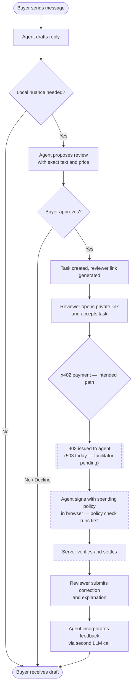
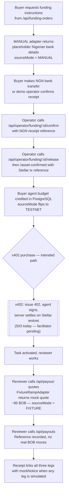
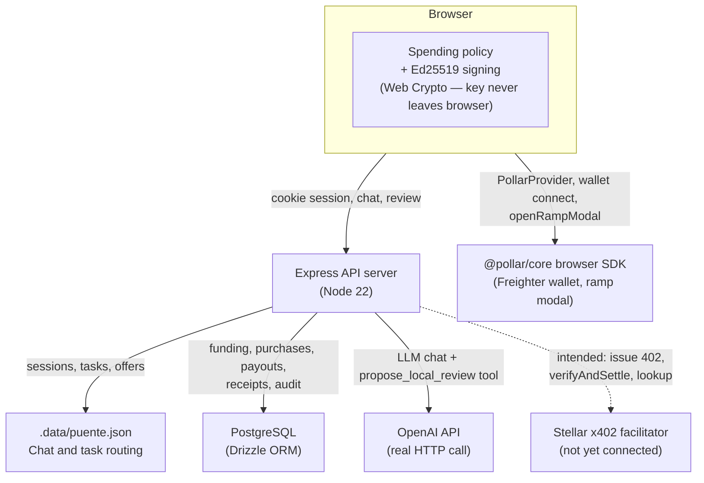
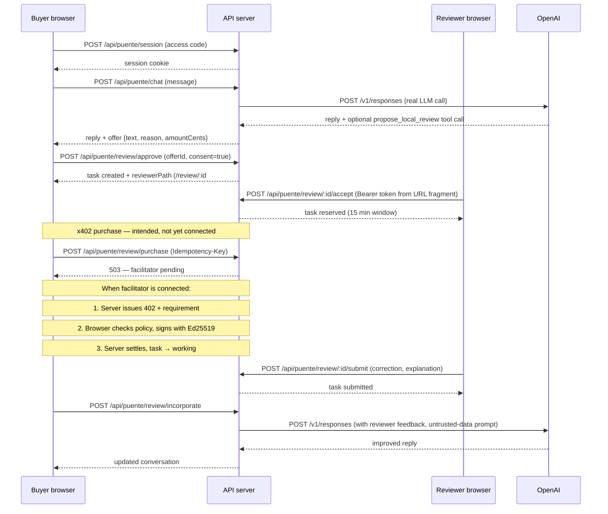

# Puente

**Puente brings paid local human knowledge into an AI conversation.**

An x402-powered marketplace that connects an African-funded AI buyer to a Bolivian reviewer—through a real LLM, a structured task market, and a traceable payment corridor.

Pollar Hackathon · Flagship Africa–Latin America challenge · Builder: De real iManuel · Submission deadline: 18 September 2026, 13:00 UTC

---

## Submission links

| Item | Link |
|------|------|
| Live demo | _add before submission_ |
| Demo video | _add before submission_ |
| Testnet transaction evidence | _add before submission_ |

See [docs/SUBMISSION-CHECKLIST.md](docs/SUBMISSION-CHECKLIST.md) for all outstanding items.

---

## The problem

An AI can write fluent Spanish. What it cannot do is know whether a phrase lands awkwardly in La Paz, or carries an unintended cultural meaning in Santa Cruz. Hiring someone across borders for a small one-time review is slow and payment is a friction point: international wire transfers, missing banking infrastructure, and intermediary fees all discourage small transactions.

---

## The solution

Puente turns local human judgment into a service an AI agent can call, and pay for, in a single conversation.

**The story in one example:** A Nigerian business wants to adapt three campaign headlines for Bolivia. Its AI agent drafts them, then proposes a paid review by someone who actually speaks Bolivian Spanish. The buyer sees the exact text and price before approving. The agent encounters an x402 payment requirement and signs it within its pre-set spending limits—entirely in the browser, with no private key touching the server. A reviewer opens a private link, improves the text, and submits structured feedback. The agent incorporates the correction and the buyer sees the revised campaign. The reviewer can then request a BOB cash-out through Pollar.

Three participants, one traceable corridor:
- **Buyer** — Nigerian business, funds an agent budget, sets a spending policy
- **Agent** — LLM that drafts text and can propose paid review
- **Reviewer** — human who provides local judgment and receives payment

---

## Product journey



Steps shown with a dashed border require the Stellar x402 facilitator, which is not yet connected. Everything else is implemented and functional.

---

## African-to-Bolivian payment path



The NGN leg is a **semi-manual operator flow** — acceptable per the organiser brief. The BOB payout is **intentionally mocked** for the hackathon. Real naira does not purchase redeemable testnet tokens; these are separate evidenced legs that share a task ID.

---

## System architecture



The dashed arrow to X402 reflects `UnsupportedStellarX402Adapter` — the interface and full purchase flow are coded; the facilitator connection is pending.

Server-held secrets: `OPENAI_API_KEY`, `APP_ACCESS_CODE`, `OPERATOR_SECRET`, `DATABASE_URL`, `X402_*` variables.
Browser-safe public value: `POLLAR_PUBLISHABLE_KEY` (publishable key only, validated against `pub_testnet_*` / `pub_mainnet_*` pattern before exposure).

---

## Approval and payment sequence



---

## What works today

| Feature | Status | Evidence / Limitation |
|---------|--------|----------------------|
| LLM chat with `propose_local_review` tool | Verified locally | Real OpenAI API call in `model.ts`; requires `OPENAI_API_KEY` + `OPENAI_MODEL` |
| Buyer approves offer, task created | Verified locally | `POST /api/puente/review/approve`; consent + offer ID validated server-side |
| Reviewer access via private link | Verified locally | Token in URL fragment; SHA-256 hash stored; timing-safe comparison |
| Reviewer accepts and submits | Verified locally | Reserve → submit state machine in `routes.ts` |
| Agent incorporates reviewer feedback | Verified locally | Second LLM call with reviewer text sandboxed as untrusted input |
| Nigerian funding state machine | Implemented, not verified on live rails | `ManualFundingAdapter` — placeholder bank details; real bank integration pending. State machine (INSTRUCTIONS_ISSUED → ASSET_CONFIRMED) tested by `funding-corridor.integration.test.mjs` |
| Operator funding confirmation endpoints | Implemented, not verified | `POST /api/operator/funding/:id/confirm` / `release` / `asset-confirmed`; requires `OPERATOR_SECRET` |
| Agent budget accounting (PostgreSQL) | Implemented, not verified | `budget-service.ts` with `SELECT FOR UPDATE`; in-memory model tested |
| Spending policy form | Verified locally | Browser-side Ed25519 key generation; `checkPolicy` runs before any network call |
| x402 purchase flow (protocol) | Implemented, not verified | `payments.ts` issues 402, sets `WWW-Authenticate: x402`, handles `X-Payment` header. `AgentPaymentPanel` performs full 402→sign→retry cycle. Blocked by `UnsupportedStellarX402Adapter` (503 today) |
| Pollar wallet connect (browser) | Implemented, not verified | `@pollar/core` + `@pollar/react` 0.10.1 installed; `PollarProvider` + Freighter login in `pollar-tools.tsx`. Requires `POLLAR_PUBLISHABLE_KEY` |
| Pollar ramp modal | Implemented, not verified | `openRampModal()` wired to button; requires connected wallet + key |
| BOB payout quote + authorise | Mocked (intentional) | `FixtureRampAdapter` — deterministic mock (~95 BOB, 5000 fee). `sourceMode = FIXTURE`. No real Pollar ramp call. UI shows "Testnet simulation — no real BOB payout" |
| Receipt linking all three legs | Implemented, not verified | `receipt-service.ts` assembles funding + payment + payout legs; `mockNotice` present when any leg is simulated |
| Duplicate-purchase prevention | Tested | `settlement_network_provider_unique` index + `ON CONFLICT DO NOTHING`; tested by `x402-flow.integration.test.mjs` |
| Crash recovery / reconciliation | Implemented, not verified | `job-worker.ts` polls `RECONCILE_PURCHASE` jobs every 10 s; modelled in `crash-recovery.integration.test.mjs` |
| Secrets fail-closed | Verified locally | `flow.test.mjs` starts server without credentials; all money integrations return 503 |
| CI (typecheck + build + test + check:secrets) | Verified | `.github/workflows/check.yml` runs on push |

---

## Run locally

**Prerequisites**

- Node.js 22 or later
- pnpm 10.28.2 (`npm install -g pnpm@10.28.2`)
- PostgreSQL database (local or hosted)

**Configuration**

Copy `.env.example` to `.env` and fill in the values listed below. Never commit the filled-in file.

| Variable | Where it belongs | Purpose |
|----------|-----------------|---------|
| `DATABASE_URL` | Server secret | PostgreSQL connection string |
| `OPENAI_API_KEY` | Server secret | LLM chat |
| `OPENAI_MODEL` | Server secret | Model name, e.g. `gpt-4o` |
| `APP_ACCESS_CODE` | Server secret | Gate for session creation (≥ 16 chars) |
| `OPERATOR_SECRET` | Server secret | Operator endpoint authentication (≥ 32 chars) |
| `POLLAR_PUBLISHABLE_KEY` | Server config (safe to expose) | Pollar browser SDK key (`pub_testnet_…`) |
| `POLLAR_NETWORK` | Server config | `testnet` or `mainnet` |
| `X402_FACILITATOR_URL` | Server secret | Required when `PAYMENT_MODE=live` (pending) |
| `X402_NETWORK` | Server secret | Required when `PAYMENT_MODE=live` (pending) |
| `X402_ASSET_ID` | Server secret | Required when `PAYMENT_MODE=live` (pending) |
| `X402_ASSET_DECIMALS` | Server secret | Required when `PAYMENT_MODE=live` (pending) |
| `API_PORT` | Optional | Default `3001` |

**Setup and start**

```bash
pnpm install
pnpm --filter @workspace/db push   # apply schema to your PostgreSQL database
pnpm build:puente                  # typecheck + build frontend + API
pnpm start                         # serve on http://localhost:3001
```

For active development (builds the API once, then starts the API server and the Vite frontend dev server):

```bash
pnpm dev
```

**Tests** (no credentials or paid calls required)

```bash
pnpm test:puente
```

**Other checks**

```bash
pnpm typecheck
pnpm check:secrets
```

---

## Demo walkthrough

See [docs/DEMO.md](docs/DEMO.md) for the full two-minute recording plan.

Short version:

1. Open `http://localhost:3001` in a browser. Enter the access code to start a session.
2. Send a message asking for help writing a campaign in Bolivian Spanish, e.g. _"I need three campaign headlines for Bolivia."_
3. The agent drafts them, then proposes a paid local review. Click **Approve** after reading the text and price.
4. Copy the reviewer link from the response and open it in a second browser tab (or incognito window).
5. In the reviewer tab, accept the task, enter a correction and explanation, and submit.
6. Back in the buyer tab, click **Incorporate feedback** to see the agent's revised campaign.

The Nigerian funding card and BOB payout card are visible in the operator and reviewer views respectively. Both carry `MANUAL` / `FIXTURE` source-mode badges so their simulated status is always visible.

**Note:** x402 purchase is intentionally blocked (503) until a supported Stellar facilitator is configured. The reviewer can accept and submit without payment completing — this demonstrates the full flow structure even without a live facilitator.

---

## Limitations and next steps

**x402 facilitator missing.** `UnsupportedStellarX402Adapter` throws on every method. The complete client-side signing flow (spending policy → Ed25519 sign → X-Payment header → 402 retry) is coded and tested, but the server cannot settle a real testnet transaction until the Pollar-supported Stellar facilitator URL, network, asset ID and mechanism package are supplied. This is the single most important blocker.

**Nigerian funding is a manual operator flow.** Bank details in the current adapter are placeholders. A real operator must manually confirm receipt and then call the asset-confirmed endpoint with a Stellar testnet transaction reference. There is no automated NGN payment provider integration.

**Reviewer identity is token-only.** The reviewer link token proves knowledge of the URL — it does not verify wallet ownership, location, or language skill. Country and language declarations are self-reported.

**No escrow.** Payment is direct and prepaid. If the reviewer does not deliver, the buyer must request a worker-authorised refund manually. No on-chain lock is in place.

**BOB payout is mocked.** `FixtureRampAdapter` always returns `sourceMode = FIXTURE`. The Pollar ramp API is not called. The `openRampModal()` integration in the browser SDK is connected but cannot be exercised without a funded testnet wallet and a confirmed purchase.

**Two data layers.** The chat and review flow uses `.data/puente.json` (file store). The funding, payment, and payout flows use PostgreSQL. These are reconciled by task ID in the receipt service but are not yet unified in a single session context.

**No deployment configuration.** No `Dockerfile`, `fly.toml`, or similar is present. The demo must run from a local checkout or a manually configured host.

**Persistence is local.** The JSON store does not survive a database migration or a deployment that replaces the data directory. Use a persistent volume or external storage for a hosted demo.

---

## Documentation

- [docs/ARCHITECTURE.md](docs/ARCHITECTURE.md) — component diagram, trust boundaries, data flow, state machines
- [docs/AFRICAN-PATH.md](docs/AFRICAN-PATH.md) — Nigerian funding flow, operator procedure, failure handling
- [docs/DEMO.md](docs/DEMO.md) — two-minute recording script with screen action and narration
- [docs/SUBMISSION-CHECKLIST.md](docs/SUBMISSION-CHECKLIST.md) — outstanding links, verification steps, submission tasks

---

**Puente gives AI a way to buy local judgment — and gives the person who provides it a path to local payment.**
