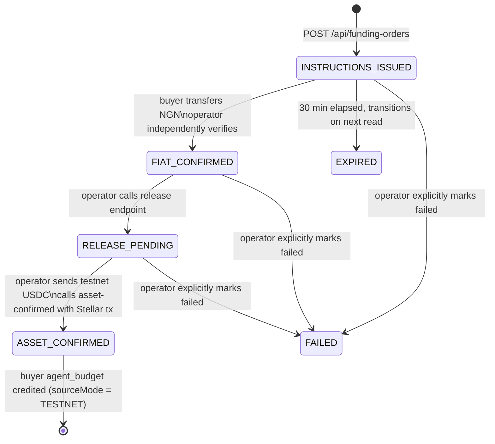

# Puente — African funding path

This document describes the Nigerian-to-USDC funding corridor as implemented today, the operator's manual procedure for the hackathon demo, and how failures are handled at each step.

---

## Overview

The African leg converts Nigerian naira (NGN) into testnet USDC that the buyer's AI agent can spend on the task marketplace. It is a **semi-manual operator flow**, which the Pollar hackathon organiser brief explicitly accepts.

"Manual" here does not mean the implementation is missing — it means no automated NGN payment provider is wired in yet. The state machine, database records, API endpoints, audit trail, and budget crediting are all implemented. A human operator bridges the gap between the Nigerian bank transfer and the on-chain testnet credit.

---

## Participants

| Role | Responsibility |
|------|---------------|
| **Buyer** | Initiates a funding order, transfers NGN to the demo operator's account |
| **Demo operator** | Receives NGN, independently verifies the transfer, calls the confirmation API, authorises testnet asset release |
| **Puente API** | Maintains the funding state machine, credits the buyer's agent budget on confirmation |

The operator controls the pre-funded testnet liquidity wallet. Puente does not hold this wallet's keys — the operator releases their own testnet USDC directly to the buyer's agent account upon confirming receipt.

---

## Funding state machine



---

## API endpoints

All operator endpoints require `Authorization: Bearer <OPERATOR_SECRET>` (minimum 32-character secret, timing-safe comparison). The buyer endpoints require an `x-buyer-id` header identifying the authenticated buyer.

### Buyer: create funding order

```
POST /api/funding-orders
x-buyer-id: <buyerId>

{
  "ngnMinorUnits": "5000000",          // kobo — 50,000 NGN
  "expectedAssetBaseUnits": "1000000"  // USDC microunits — 1.000000 USDC
}
```

Response includes placeholder bank details from `ManualFundingAdapter`:

```json
{
  "id": "...",
  "status": "INSTRUCTIONS_ISSUED",
  "sourceMode": "MANUAL",
  "bankAccountName": "Puente Demo Operator",
  "accountNumber": "0123456789",
  "bankName": "First Bank Nigeria",
  "providerReference": "...",
  "expiresAt": "...",
  "ngnMinorUnits": "5000000",
  "expectedAssetUnits": "1000000"
}
```

**Important:** the bank details in the current adapter are placeholders for the hackathon demo. A live integration would call a real Nigerian payment provider (e.g. Flutterwave, Paystack) to generate a dynamic virtual account.

### Buyer: poll funding order status

```
GET /api/funding-orders/:id
x-buyer-id: <buyerId>
```

The Nigerian funding card in the frontend polls this endpoint every 5 seconds. The `sourceMode` badge is always visible in the UI.

### Operator: confirm NGN receipt

```
POST /api/operator/funding/:id/confirm
Authorization: Bearer <OPERATOR_SECRET>

{
  "ngnReceiptReference": "NXP2024091800123"  // 1–100 chars, bank reference
}
```

The operator calls this after independently verifying the NGN transfer in their banking dashboard. This does not move any funds — it records that fiat was received.

Transitions: `INSTRUCTIONS_ISSUED` → `FIAT_CONFIRMED`

### Operator: initiate asset release

```
POST /api/operator/funding/:id/release
Authorization: Bearer <OPERATOR_SECRET>

{
  "releaseReference": "RELEASE-001"
}
```

The operator calls this when they are about to send testnet USDC from their liquidity wallet. The `ManualFundingAdapter.checkWalletBalance()` always returns `confirmed: true` in the current implementation (attestation model — the operator's confirmation is the evidence).

Transitions: `FIAT_CONFIRMED` → `RELEASE_PENDING`

### Operator: confirm on-chain asset receipt

```
POST /api/operator/funding/:id/asset-confirmed
Authorization: Bearer <OPERATOR_SECRET>

{
  "stellarTxReference": "abc123...",
  "confirmedBaseUnits": "1000000"
}
```

After sending testnet USDC on Stellar, the operator provides the transaction hash and the confirmed amount. This triggers the budget credit atomically in the same database transaction.

Transitions: `RELEASE_PENDING` → `ASSET_CONFIRMED` + `agent_budgets` credited

The `sourceMode` for the order and its audit event are set to `TESTNET` at this step. All earlier steps are `MANUAL`.

---

## Operator procedure for the hackathon demo

This is the step-by-step procedure a demo operator follows. It requires the server running with `OPERATOR_SECRET` configured.

1. Start the server and open the buyer chat at `http://localhost:3001`.
2. When the buyer clicks "Fund your agent budget", a funding order appears in the UI with a provider reference.
3. The operator logs the provider reference and the NGN amount.
4. For the demo: the operator confirms receipt immediately (no real bank transfer needed in a sandbox run) by calling the confirm endpoint with a made-up receipt reference. Record that this is a sandbox confirmation.
5. The operator sends testnet USDC from their pre-funded Stellar testnet wallet to the buyer's agent account on Stellar testnet.
6. After the Stellar transaction confirms, the operator calls the asset-confirmed endpoint with the real Stellar testnet transaction hash and the confirmed amount in base units.
7. The buyer's funding card in the UI transitions to `ASSET_CONFIRMED` (sourceMode = TESTNET). The Stellar tx reference is shown in the UI and the buyer can proceed with the task.

The operator can list all pending orders:

```
GET /api/operator/funding-orders
Authorization: Bearer <OPERATOR_SECRET>
```

---

## Evidence labelling

Every response from the funding endpoints includes a `sourceMode` field. The UI always renders this as a visible badge. Audit events in the database record the `sourceMode` at every transition.

| Step | sourceMode | What it means |
|------|-----------|---------------|
| Order created | `MANUAL` | Placeholder bank details, no real provider called |
| NGN confirmed | `MANUAL` | Operator attestation only |
| Release pending | `MANUAL` | Operator attestation only |
| Asset confirmed | `TESTNET` | Real Stellar testnet transaction; fake USDC |
| Payout | `FIXTURE` | Mock BOB quote and reference; no real Pollar ramp |

The receipt service adds `mockNotice: "This transaction was simulated and does not represent real funds."` to any receipt where one or more legs carries a non-LIVE sourceMode. For the hackathon demo, all legs will carry this notice.

---

## Failure handling

| Failure | Server behaviour | User-facing message |
|---------|-----------------|---------------------|
| Order expires before confirmation | Next read transitions to `EXPIRED` | Funding card shows expired state with retry option |
| Operator attempts to confirm an already-confirmed order | 409 with `currentState` | Operator sees current state in response |
| Out-of-order transitions (e.g. release before confirm) | 409 with `currentState` | Operator sees which transition is invalid |
| Unknown order ID | 404 | Standard not-found |
| `confirmedBaseUnits` is not a valid integer string | 400 MoneyValidationError | Field name and reason in response |
| `DATABASE_URL` not configured | Server throws on first DB request (lazy initialisation) | 500 — no crash at startup |
| `OPERATOR_SECRET` too short or missing | 403 on all operator endpoints | No error detail to avoid enumeration |

Budget credits are atomic with the `ASSET_CONFIRMED` transition inside a single database transaction. A crash between the Stellar send and the API call leaves the order in `RELEASE_PENDING`. The operator re-calls `asset-confirmed` with the same transaction reference — the `SELECT FOR UPDATE` lock prevents double-credit.

---

## What is not yet built

- **Automated NGN provider integration.** Flutterwave, Paystack, or a similar provider would replace `ManualFundingAdapter.createInstructions()` with a real virtual account API call, and provide a webhook for automatic confirmation. The `FundingPort` interface and the operator confirmation endpoints are the extension points.
- **Real wallet balance check.** `ManualFundingAdapter.checkWalletBalance()` always returns `confirmed: true`. A live adapter would query the Stellar Horizon API for the buyer's wallet balance before releasing.
- **Automated release.** In production, the operator step could be replaced by an automated liquidity provider that listens for NGN confirmation webhooks and triggers the release automatically. The state machine and audit trail are designed to support this without breaking the semi-manual flow.
- **NGN/USDC rate and fees.** The current adapter uses a placeholder rate of `1` and zero fees. A real integration would fetch a live rate and record the exact fee separately from the principal.
