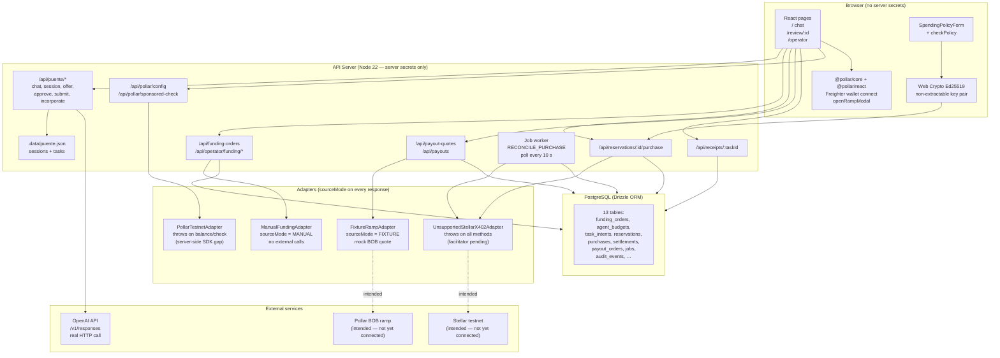
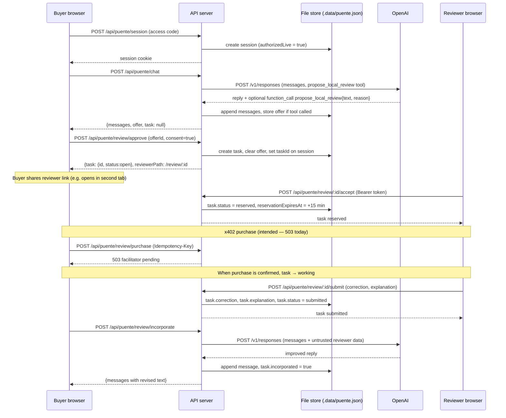
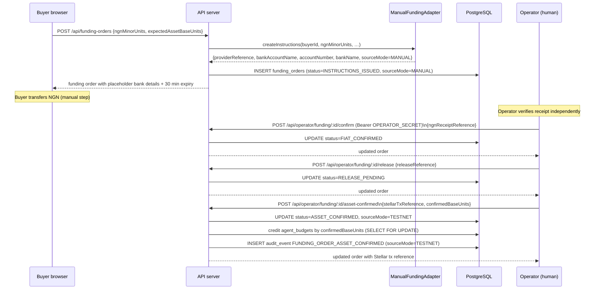
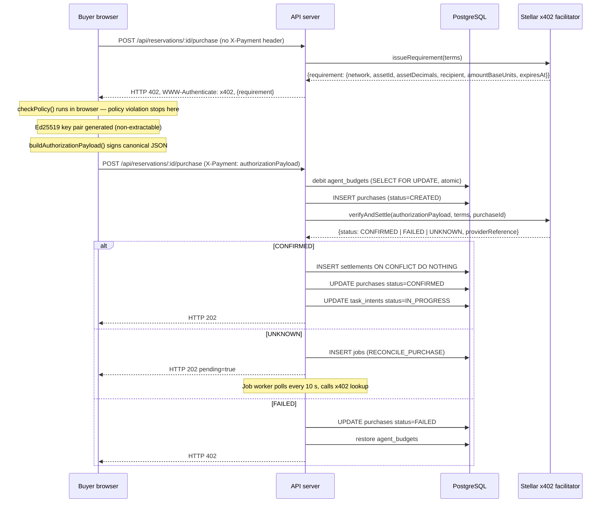
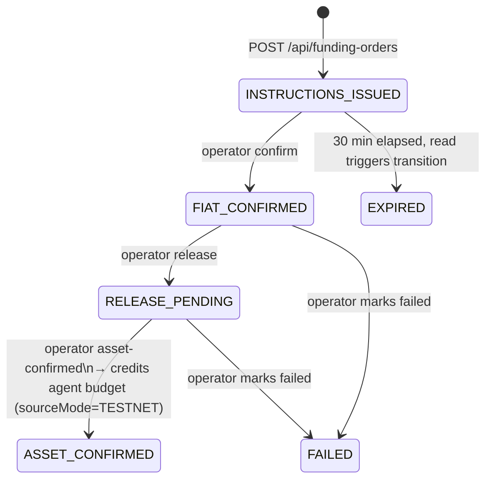
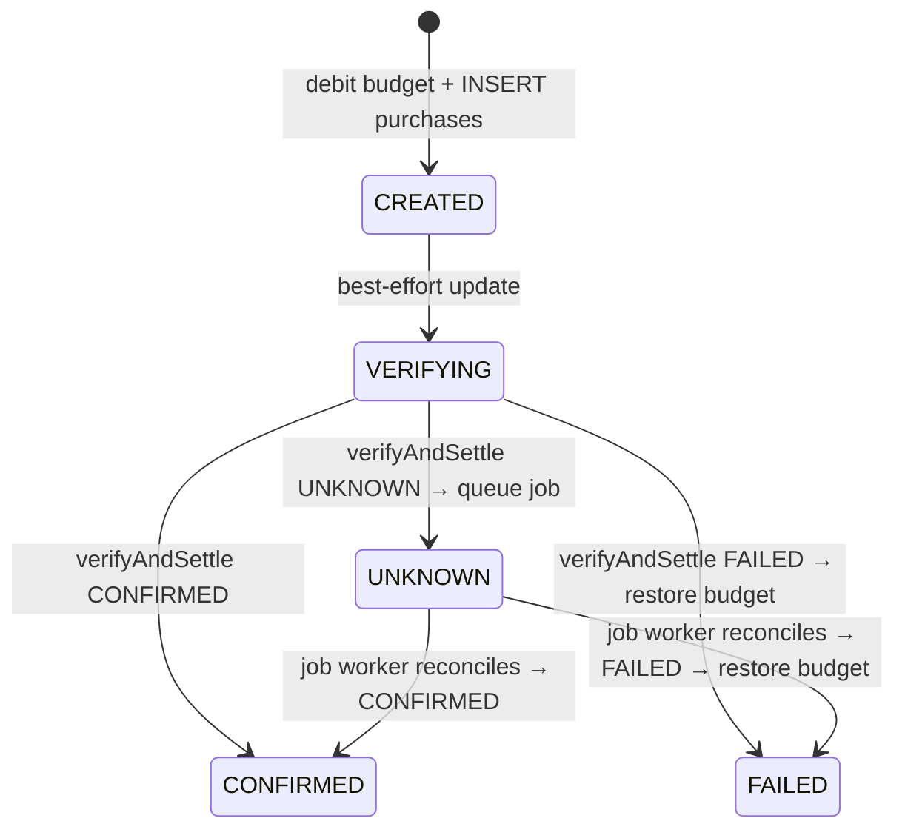
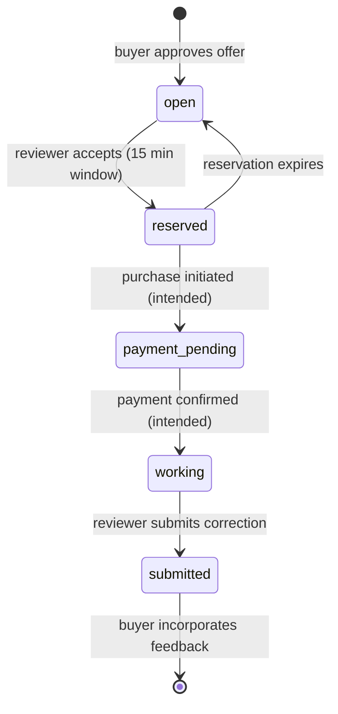
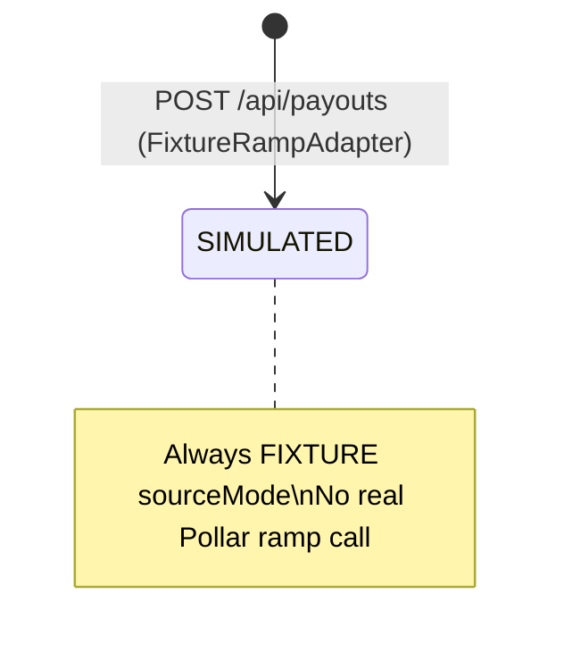

# Puente — Architecture

This document covers component relationships, trust boundaries, data flow, state machines, and the adapter contract. It is the reference for anyone extending or verifying the implementation.

---

## 1. Repository layout

```
Puente/
├── artifacts/
│   ├── api-server/          Express API — chat, funding, x402, payout, receipt
│   ├── agent-signer/        Ed25519 signing library (Node crypto + Web Crypto mirrors)
│   └── puente/              React + Vite frontend (buyer chat, reviewer page, operator page)
├── lib/
│   ├── db/                  Drizzle ORM schema + PostgreSQL migrations
│   ├── api-client-react/    React Query hooks for the API
│   ├── api-spec/            Shared API type definitions
│   └── api-zod/             Zod validation schemas
├── tests/
│   ├── flow.test.mjs        Server smoke test (no credentials)
│   ├── integration/         In-memory model tests (no DB or network)
│   └── properties/          Property-based tests using fast-check
├── scripts/                 Dev runner, secret scanner, pnpm guard
└── .data/puente.json        Runtime chat + task state (file store)
```

---

## 2. Component diagram



---

## 3. Trust boundaries

| Boundary | What crosses it | What does not |
|----------|----------------|---------------|
| Browser → API server | Session cookie (httpOnly, SameSite=Strict), JSON request body, `X-Payment` header (signed payload), `Idempotency-Key` | Private keys, `OPENAI_API_KEY`, `OPERATOR_SECRET`, `DATABASE_URL` |
| API server → OpenAI | Message history (last 20 turns), system prompt, tool definitions | Buyer identity, wallet addresses, payment amounts |
| API server → PostgreSQL | All payment state, funding orders, audit events | Raw secrets |
| Reviewer link | Token in URL fragment (`#key`) — browser never sends fragment to server; client extracts and sends as `Authorization: Bearer` | Wallet keys, payment references |
| Operator endpoints | `Authorization: Bearer <OPERATOR_SECRET>` — SHA-256 hashed, timing-safe comparison | Secret value is never logged or echoed |
| `POLLAR_PUBLISHABLE_KEY` | Returned by `/api/pollar/config` only after passing regex `pub_(testnet\|mainnet)_[A-Za-z0-9]+` | Raw value not returned when validation fails |

The buyer's Ed25519 private key is generated with `{ extractable: false }` in the browser's Web Crypto API. It never leaves the JavaScript execution context and is discarded on page reload. The server receives only the `authorizationPayload` (base64url envelope containing the public key, signed canonical request, and signature).

The agent signer library (`artifacts/agent-signer`) mirrors the same signing logic for server-side or CLI use. Its private key material must be supplied only through environment or secrets management — never source control.

---

## 4. Data flow: buyer conversation to incorporated review



---

## 5. Data flow: Nigerian funding corridor



After `ASSET_CONFIRMED`, the buyer's `agent_budgets.balance_base_units` is incremented atomically in the same transaction. The `sourceMode` switches from `MANUAL` to `TESTNET` at this step.

---

## 6. Data flow: x402 purchase (intended path)

The purchase route is fully coded. `UnsupportedStellarX402Adapter` blocks it at the adapter layer. The sequence below shows the intended flow once a facilitator is supplied.



Idempotency: the same `Idempotency-Key` + matching request hash returns the original response without re-debiting. A different request body with the same key returns 409.

---

## 7. State machines

### Funding order



### Purchase



### Chat task (file store)



### Payout order



---

## 8. Database schema (key tables)

Defined in `lib/db/drizzle/0000_far_proemial_gods.sql`. Applied via `pnpm run db:push`.

| Table | Purpose | Key constraints |
|-------|---------|----------------|
| `users` | Buyers, workers, operators | `auth_subject` unique |
| `agent_budgets` | Buyer USDC balance (base units, bigint) | `buyer_id` unique; credits/debits use `SELECT FOR UPDATE` |
| `funding_orders` | NGN→USDC corridor state machine | `provider_reference` unique |
| `task_intents` | Task content, locale, deadline | Indexed on `(buyer_id, created_at)` |
| `reservations` | Worker assignment per task | `task_id` unique (one active reservation) |
| `purchases` | x402 payment state | `(buyer_id, idempotency_key)` unique; `reservation_id` unique |
| `settlements` | Confirmed payment records | `(network, provider_reference)` unique — prevents double-credit |
| `jobs` | Durable reconciliation queue | `(kind, aggregate_id, status)` unique — prevents duplicate jobs |
| `payout_orders` | BOB payout records | `(worker_id, idempotency_key)` unique |
| `audit_events` | Immutable event log | Append-only; every state transition writes an event |
| `webhook_events` | Idempotent webhook deduplication | `(provider, event_id)` unique |

All monetary values are stored as `bigint` base units. Currency, network, and asset issuer are stored alongside amounts — no implicit asset assumptions.

---

## 9. Adapter contract

Every adapter response carries `sourceMode: "LIVE" | "TESTNET" | "SANDBOX" | "MANUAL" | "FIXTURE"`. The `assertSourceMode()` guard in `lib/source-mode-guard.ts` runs at every call site; a missing or unrecognised value returns HTTP 502 rather than silently writing bad state.

| Adapter | Class | sourceMode | External calls |
|---------|-------|-----------|----------------|
| Nigerian funding | `ManualFundingAdapter` | `MANUAL` | None — placeholder bank details |
| x402 settlement | `UnsupportedStellarX402Adapter` | `LIVE` (never reached) | None — throws `IntegrationConfigurationError` on every method |
| BOB ramp | `FixtureRampAdapter` | `FIXTURE` | None — deterministic mock values |
| Pollar server wallet | `PollarTestnetAdapter` | `TESTNET` (never reached) | None — throws; `@pollar/core` does not expose server-side wallet helpers |

The `assertLivePaymentConfiguration()` guard prevents the server from starting in live payment mode without all required `X402_*` environment variables. Even with those variables present, it throws — a supported Stellar mechanism package must be installed and wired before live mode can operate.

---

## 10. Security notes

- **CSRF:** mutations use SameSite=Strict cookies; the server also checks that the `Origin` header matches the `Host` header for non-GET requests.
- **Rate limiting:** 120 requests/minute per IP globally; 12 model calls/minute per session.
- **Session cap:** 1,000 concurrent sessions; sessions older than 24 hours are pruned.
- **Reviewer text sandboxing:** reviewer `correction` and `explanation` are passed to the LLM wrapped in an explicit untrusted-data prompt that forbids instruction following. The model cannot raise spend limits or alter payment state.
- **Operator secret:** minimum 32 characters; hashed before timing-safe comparison; never logged or echoed.
- **No raw identity documents:** KYC status is stored as a provider reference only. Worker country/language is self-declared.
- **Secret scan:** `pnpm check:secrets` runs in CI and on commit.
