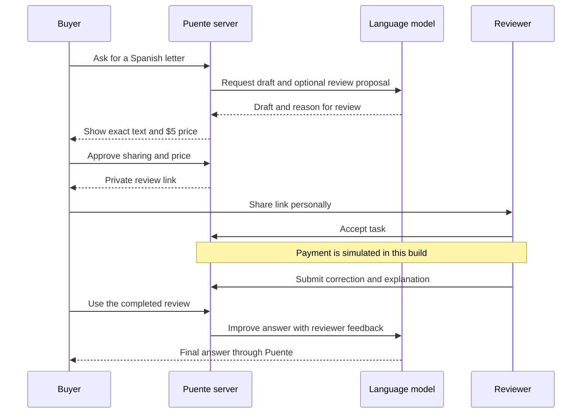
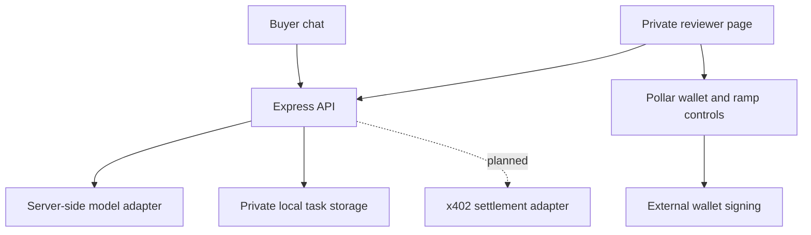

# How Puente works

The buyer authorises a specific review. The agent helps with the writing. The reviewer is a separate person who receives only the approved text.

In rehearsal mode, a script supplies the draft and returns the human's correction. Live mode calls the model on the server. Neither mode currently moves task funds.

## Where to work

- `artifacts/puente/src/pages/chat.tsx`: buyer conversation.
- `artifacts/puente/src/pages/reviewer.tsx`: reviewer task and correction.
- `artifacts/puente/src/components/pollar-tools.tsx`: configured SDK controls.
- `artifacts/api-server/src/puente/routes.ts`: consent, access checks and task progression.
- `artifacts/api-server/src/puente/model.ts`: live model and scripted rehearsal.
- `artifacts/api-server/src/puente/store.ts`: private single-process persistence.

The browser cannot choose the price. A model proposal cannot make a purchase. Task acceptance and submission are repeat-safe. Buyer sessions use an HTTP-only cookie; reviewer links carry a secret in the fragment, moved into session storage before API access. Rotating a link invalidates the old one. Possessing that link grants access; it does not prove someone lives in Bolivia.
